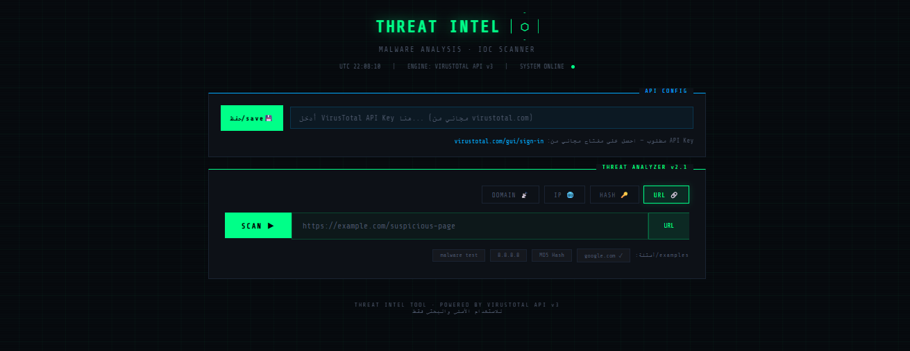
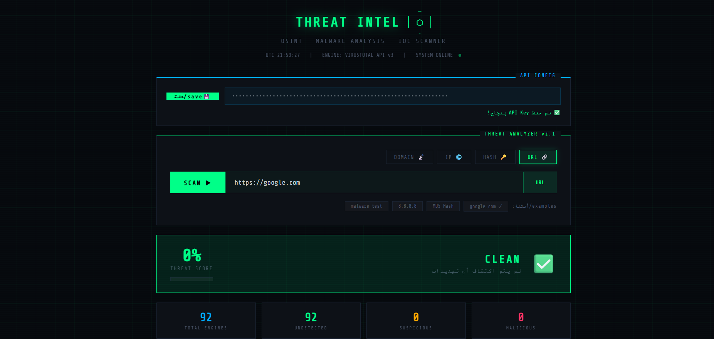
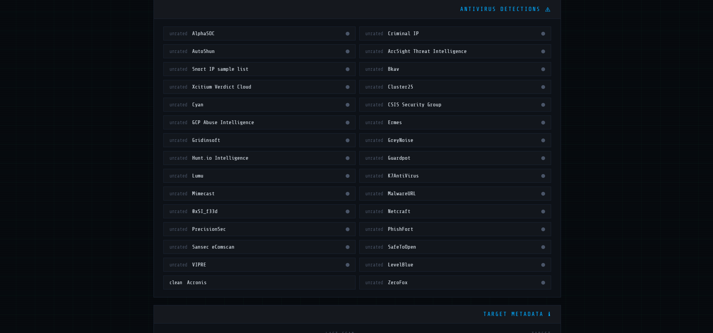
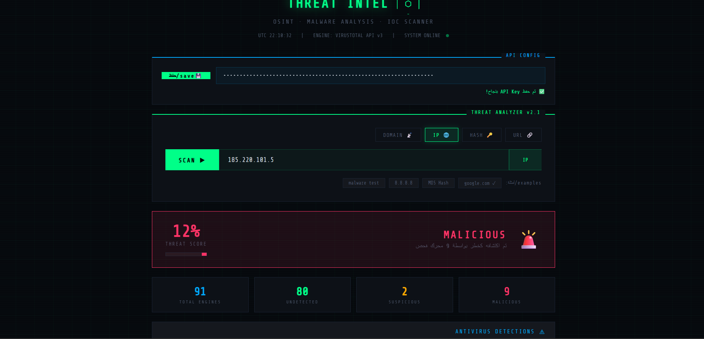
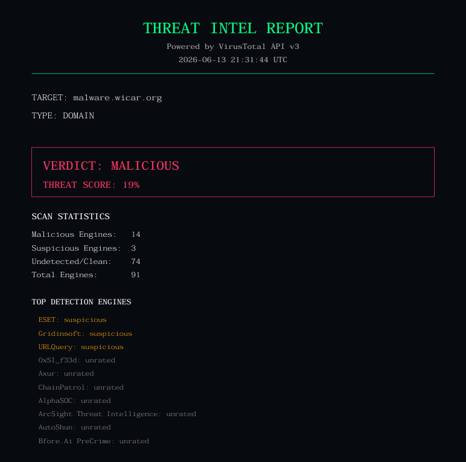

# 🛡️ THREAT INTEL — IOC Scanner & Malware Analysis Tool

<div align="center">

**أداة أمن سيبراني تفاعلية لفحص وتحليل المؤشرات المشبوهة (IOCs)**
**An interactive cybersecurity monitoring tool for scanning and analyzing Indicators of Compromise (URLs, IPs, Domains, File Hashes)**

Built with HTML, CSS & Vanilla JavaScript · Powered by VirusTotal API v3

</div>

---

## 📸 Screenshots

### Main Dashboard


### Main Dashboard — Clean Result


### Antivirus Detection Engines Grid


### Malicious IP Detection


### PDF Report Export


---

## ✨ Features | الميزات

- 🔍 **Multi-type scanning**: URL, IP Address, Domain, and File Hash (MD5/SHA1/SHA256)
- 🎯 **Aggregated Threat Score**: automatically calculated percentage based on 70+ security engines
- 🚦 **Smart Verdict Banner**: instant CLEAN / SUSPICIOUS / MALICIOUS classification with color-coded UI
- 🧩 **Detection Engines Grid**: sorted results (malicious → suspicious → undetected → clean)
- 🌍 **Geolocation + Country Info**: displays target's country, ASN, and ISP/owner data
- 📄 **PDF Report Export**: generates a downloadable professional report (a feature not available in VirusTotal's free tier)
- 🌙 **SOC-style Dark Theme**: terminal-inspired UI with RTL Arabic support
- 🔐 **Client-side API Key storage**: your VirusTotal API key stays in your browser (localStorage) — never sent anywhere else

---

## 🛠️ Tech Stack

| Layer | Technology |
|---|---|
| Frontend | HTML5, CSS3, Vanilla JavaScript (no frameworks) |
| Data Source | [VirusTotal API v3](https://docs.virustotal.com/reference/overview) |
| PDF Generation | [jsPDF](https://github.com/parallax/jsPDF) (CDN) |
| Fonts | Share Tech Mono, Tajawal (Google Fonts) |
| Local Server | Node.js + `package.json` (for CORS-free local development) |

---

## ⚙️ How It Works

1. **Input**: User enters a target — a URL, domain, IP address, or file hash.
2. **API Request**: The JavaScript front-end sends a request to VirusTotal's API v3 using the user's own API key.
3. **Aggregation**: VirusTotal queries 70+ security vendors and threat intelligence feeds (Kaspersky, GreyNoise, AlphaSOC, Netcraft, ESET, and more).
4. **Processing & Display**: The tool parses the JSON response, calculates a unified threat score, sorts detection engines by severity, and renders everything in a SOC-style dashboard.
5. **Export**: Users can download a polished PDF summary of the scan results.

---

## 🚀 Getting Started

### Prerequisites
- A free [VirusTotal API Key](https://www.virustotal.com/gui/sign-in)
- Node.js (optional, for local server)

### Run Locally

```bash
# Clone the repository
# GitHub استنساخ المستودع من 
git clone https://github.com/naif-00/threat-intel-scanner.git
cd threat-intel-scanner

# Option 1: Use a simple live server (Node.js)
npm install
npm start

# Option 2: Open directly in browser
# (some browsers may block API calls due to CORS — a local server is recommended)
```

Then:
1. Open the app in your browser.
2. Paste your VirusTotal API key into the **API CONFIG** field and click **Save**.
3. Choose a scan type (URL / IP / Domain / Hash), enter your target, and click **SCAN**.
4. Review results and optionally download the PDF report.

---

## 📋 Project Status

✅ Fully functional — successfully connects to VirusTotal API v3, retrieves real-time data, and renders results with full geolocation and PDF export support.

---

## ⚠️ Disclaimer | تنويه

This tool is intended **for educational and security research purposes only**.
هذه الأداة مخصصة **للاستخدام الأمني والبحثي فقط**.

---

## 📜 License

MIT License — feel free to use, modify, and share.
